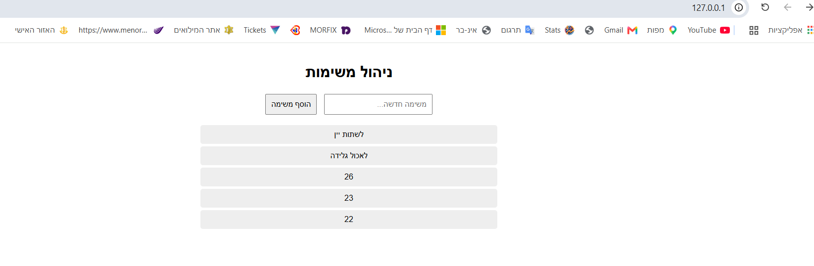
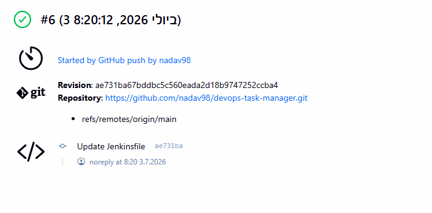
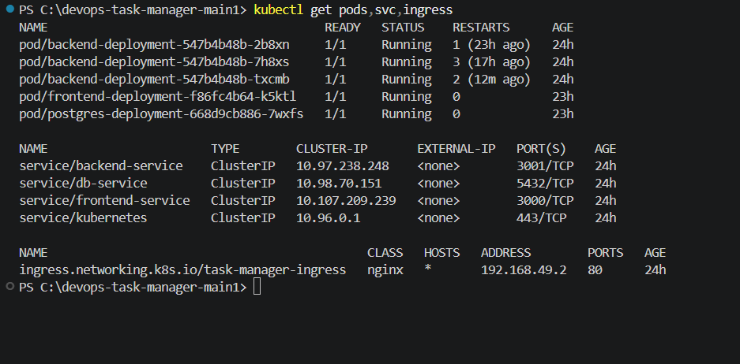
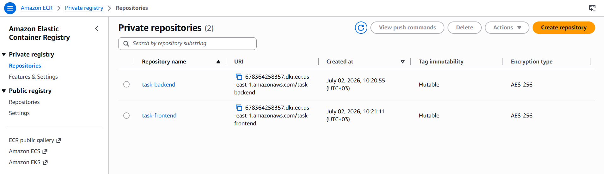
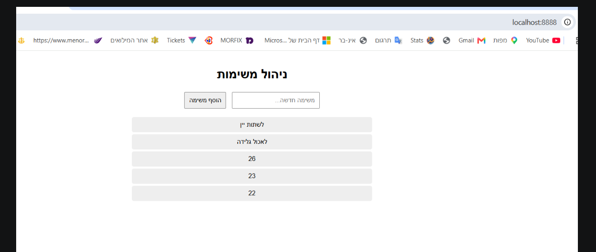

## 🚀 צילומי מסך מהפרויקט (Screenshots)

### 1. אפליקציה רצה בדפדפן דרך ה-Ingress

### 2. ה-Pipeline ב-Jenkins (סטטוס ירוק)

### 3. מאגרי ה-AWS ECR - רשימת ה-Repositories

### 4. דחיפת ה-Images של ה-Backend וה-Frontend לתוך ה-ECR

// האפליקציה עובדת

